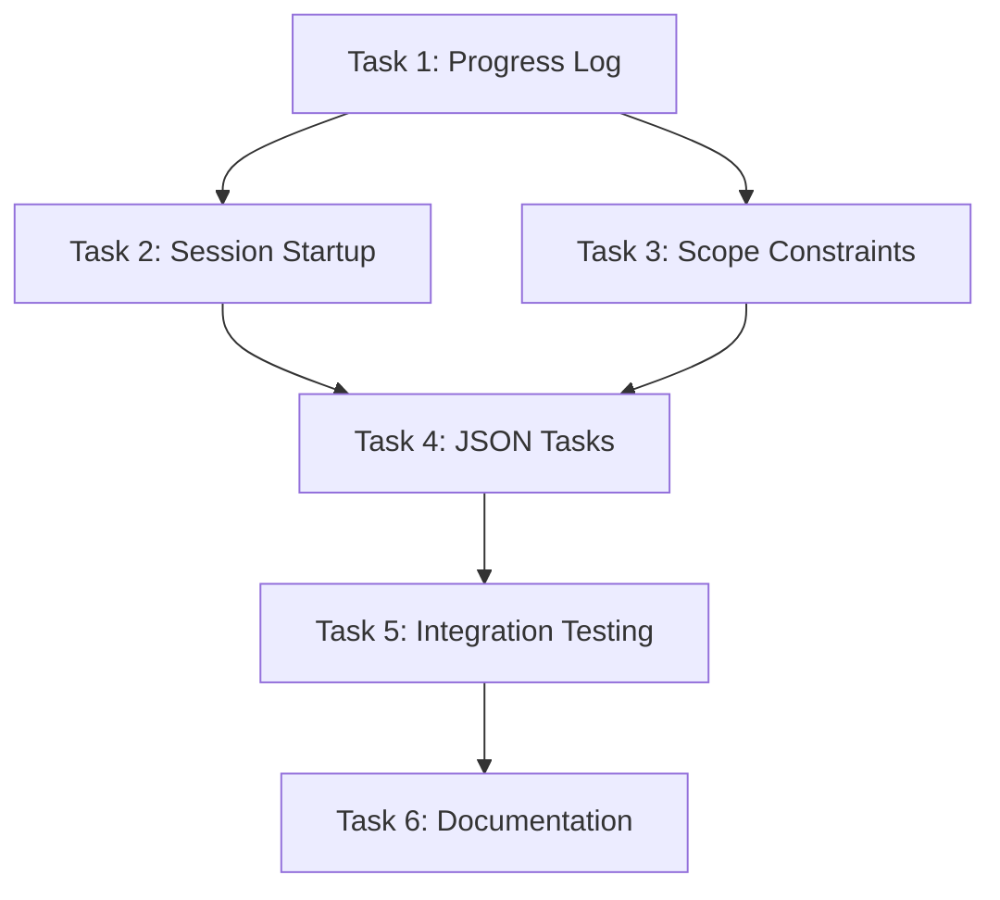

# Technical Specification: Long-Running Agent Harness

## Architecture Overview

```
.agent-os/
├── progress/                    # NEW: Persistent progress tracking
│   ├── progress.md              # Human-readable chronological log
│   ├── progress.json            # Machine-readable progress data
│   └── archive/                 # Archived entries (>30 days old)
│
├── tasks/
│   └── [spec-name]/
│       ├── tasks.md             # Existing markdown tasks
│       └── tasks.json           # NEW: Machine-readable tasks
│
├── state/
│   ├── workflow.json            # Existing workflow state
│   └── session-cache.json       # Existing (unchanged)
│
└── specs/                       # Existing (unchanged)
```

---

## Component 1: Progress Log System

### 1.1 File Structure

**progress.md format:**
```markdown
# Agent OS Progress Log

## 2025-12-08

### 14:30 - Task Completed
- **Spec**: auth-feature
- **Task**: 1.2 - Implement JWT validation
- **Status**: COMPLETED
- **Duration**: ~15 minutes
- **Notes**: Added refresh token support, all tests passing
- **Next**: Task 1.3 - Session management

### 13:45 - Session Started
- **Spec**: auth-feature
- **Focus**: Task 1.2
- **Context**: Continuing from yesterday's JWT implementation
- **Environment**: Dev server running on port 3000

---

## 2025-12-07

### 16:20 - Blocker Encountered
- **Spec**: auth-feature
- **Task**: 1.2 - Implement JWT validation
- **Status**: BLOCKED
- **Issue**: Missing JWKS endpoint configuration
- **Resolution**: Need to add JWKS_URI to environment config
```

**progress.json format:**
```json
{
  "version": "1.0",
  "entries": [
    {
      "id": "entry-20251208-143000",
      "timestamp": "2025-12-08T14:30:00Z",
      "type": "task_completed",
      "spec": "auth-feature",
      "task_id": "1.2",
      "task_description": "Implement JWT validation",
      "duration_minutes": 15,
      "notes": "Added refresh token support, all tests passing",
      "next_task": "1.3"
    },
    {
      "id": "entry-20251208-134500",
      "timestamp": "2025-12-08T13:45:00Z",
      "type": "session_started",
      "spec": "auth-feature",
      "focus_task": "1.2",
      "context": "Continuing from yesterday's JWT implementation"
    }
  ],
  "metadata": {
    "total_entries": 2,
    "oldest_entry": "2025-12-07T09:00:00Z",
    "last_updated": "2025-12-08T14:30:00Z"
  }
}
```

### 1.2 Entry Types

| Type | Trigger | Required Fields |
|------|---------|-----------------|
| `session_started` | Session startup protocol | timestamp, spec, focus_task |
| `task_completed` | Task marked complete | timestamp, spec, task_id, duration |
| `task_blocked` | Blocker documented | timestamp, spec, task_id, issue |
| `debug_resolved` | Debug session completed | timestamp, issue, resolution |
| `session_ended` | Explicit end or timeout | timestamp, summary, next_steps |

### 1.3 Operations

**Append Entry** (atomic write pattern):
```
1. Read existing progress.json
2. Validate entry schema
3. Append to entries array
4. Update metadata
5. Write to temp file
6. Atomic rename to progress.json
7. Regenerate progress.md from JSON (source of truth)
```

**Archive Old Entries** (triggered when entries > 500):
```
1. Identify entries older than 30 days
2. Move to archive/YYYY-MM.json
3. Remove from main progress.json
4. Update metadata
```

---

## Component 2: Session Startup Protocol

### 2.1 Skill Definition

**File**: `claude-code/skills/session-startup.md`

```yaml
---
name: session-startup
description: Auto-invoke at session start to verify environment and load progress context
allowed-tools:
  - Bash
  - Read
  - Grep
  - TodoWrite
---
```

### 2.2 Protocol Steps

```
STARTUP PROTOCOL (6 steps)
═══════════════════════════════════════════════════════

Step 1: Directory Verification
───────────────────────────────
ACTION: pwd
VERIFY: Working directory matches expected project root
FAIL_IF: Not in project directory

Step 2: Progress Context Load
───────────────────────────────
ACTION: Read .agent-os/progress/progress.md (last 20 entries)
EXTRACT:
  - Last session's accomplishments
  - Any unresolved blockers
  - Suggested next steps
DISPLAY: Brief summary to user

Step 3: Git State Review
───────────────────────────────
ACTION: git status && git log --oneline -5
VERIFY:
  - No uncommitted changes blocking work
  - On correct branch for current spec
  - Recent commits align with progress log
WARN_IF: Uncommitted changes detected

Step 4: Task Status Check
───────────────────────────────
ACTION: Read .agent-os/tasks/[current-spec]/tasks.md
IDENTIFY:
  - Next incomplete task
  - Any blocked tasks
  - Overall spec progress percentage
DISPLAY: Task selection to user

Step 5: Environment Health
───────────────────────────────
ACTION: Check for dev server, run quick health check
VERIFY:
  - Required services available
  - No port conflicts
  - Dependencies installed
SKIP_IF: No dev server configured

Step 6: Session Focus Confirmation
───────────────────────────────
ACTION: Present selected task to user
CONFIRM: "Ready to work on Task X.Y: [description]?"
LOG: session_started entry to progress log
```

### 2.3 Integration Point

Add to `/execute-tasks` Phase 1, Step 0 (new):
```
ACTION: session-startup skill auto-invokes
WAIT: For protocol completion
PROCEED: With existing Step 1 (Task Assignment)
```

---

## Component 3: Scope Constraint Logic

### 3.1 Implementation Location

**File**: `commands/execute-tasks.md`
**Section**: Phase 1, Step 1 (Task Assignment)

### 3.2 Constraint Logic

```
SCOPE CONSTRAINT GATE
═══════════════════════════════════════════════════════

IF user requests multiple parent tasks:

  COUNT: Number of parent tasks requested

  IF count > 1:
    DISPLAY: "
    ⚠️  Multiple Task Warning
    ─────────────────────────────────────────
    You've selected {count} parent tasks for this session.

    Research suggests focusing on ONE task per session improves:
    • Completion rate
    • Code quality
    • Context retention

    Recommendation: Start with Task {first_task_id}
    ─────────────────────────────────────────
    "

    ASK: "Continue with single task (recommended) or all {count} tasks?"
    OPTIONS:
      1. Single task (recommended)
      2. All tasks (proceed anyway)

    IF option_1:
      SET: tasks_to_execute = [first_task]
    ELSE:
      LOG: scope_override entry to progress log
      SET: tasks_to_execute = all_requested_tasks
```

### 3.3 Override Logging

When user overrides scope constraint:
```json
{
  "type": "scope_override",
  "timestamp": "2025-12-08T14:30:00Z",
  "requested_tasks": ["1.1", "1.2", "1.3"],
  "reason": "user_override",
  "note": "User chose to execute multiple tasks in single session"
}
```

---

## Component 4: JSON Task Format

### 4.1 Schema

**File**: `.agent-os/tasks/[spec-name]/tasks.json`

```json
{
  "$schema": "https://agent-os.dev/schemas/tasks-v1.json",
  "version": "1.0",
  "spec": "auth-feature",
  "spec_path": ".agent-os/specs/auth-feature/",
  "created": "2025-12-07T09:00:00Z",
  "updated": "2025-12-08T14:30:00Z",
  "tasks": [
    {
      "id": "1",
      "type": "parent",
      "description": "Implement authentication endpoints",
      "status": "in_progress",
      "subtasks": ["1.1", "1.2", "1.3"],
      "progress_percent": 66
    },
    {
      "id": "1.1",
      "type": "subtask",
      "parent": "1",
      "description": "Create login endpoint",
      "status": "pass",
      "attempts": 1,
      "completed_at": "2025-12-07T11:30:00Z",
      "duration_minutes": 45,
      "notes": null
    },
    {
      "id": "1.2",
      "type": "subtask",
      "parent": "1",
      "description": "Implement JWT validation",
      "status": "pass",
      "attempts": 2,
      "completed_at": "2025-12-08T14:30:00Z",
      "duration_minutes": 90,
      "notes": "Required JWKS endpoint fix on attempt 2"
    },
    {
      "id": "1.3",
      "type": "subtask",
      "parent": "1",
      "description": "Add session management",
      "status": "fail",
      "attempts": 0,
      "completed_at": null,
      "duration_minutes": null,
      "notes": null
    }
  ],
  "summary": {
    "total_tasks": 4,
    "completed": 2,
    "in_progress": 1,
    "blocked": 0,
    "pending": 1
  }
}
```

### 4.2 Synchronization Strategy

**Source of Truth**: `tasks.md` (human edits here)
**Generated**: `tasks.json` (auto-generated from markdown)

**Sync Triggers**:
1. After any task status change in execute-tasks
2. After /create-tasks command
3. On session startup (validation)

**Sync Algorithm**:
```
1. Parse tasks.md checkbox syntax
2. Extract task IDs, descriptions, status
3. Merge with existing tasks.json metadata (attempts, timestamps)
4. Write updated tasks.json
5. Validate bidirectional consistency
```

---

## Implementation Sequence



**Rationale**:
- Progress log is foundational (other features log to it)
- Session startup depends on progress log existing
- JSON tasks can be developed in parallel with constraints
- Integration testing validates all components together

---

## Testing Strategy

### Unit Tests
- Progress log append/archive operations
- JSON schema validation
- Markdown-to-JSON parser
- Scope constraint logic

### Integration Tests
- Full session startup protocol
- Cross-session progress persistence
- Scope override logging
- JSON/Markdown sync consistency

### Manual Validation
- Multi-session continuity test (start session, end, start new)
- Scope warning UX review
- Progress log readability check
