# Agent OS Complete User Guide

> **Your intelligent development companion with specification awareness, codebase intelligence, and automated debugging**

## 🎯 What is Agent OS?

Agent OS is an intelligent development workflow system that guides you from product concept to implementation with:

- **Specification Awareness**: Ensures code always aligns with requirements
- **Codebase Intelligence**: Understands your existing code patterns and references
- **Automated Debugging**: Intelligent error recovery and troubleshooting
- **Smart Caching**: Optimized performance with intelligent context management
- **Team Collaboration**: Consistent workflows and knowledge sharing

## 🚀 Complete Development Workflow

### The Full Development Lifecycle

```mermaid
flowchart TD
    A[💡 Product Idea] --> B[analyze-product]
    B --> C[plan-product]
    C --> D[create-spec]
    D --> E[create-tasks]
    E --> F[execute-tasks]
    F --> G[complete-tasks]
    
    subgraph "Continuous Support"
        H[🔍 index-codebase<br/>Keep references current]
        I[🐛 debug<br/>Troubleshoot issues]
        J[🔄 Caching System<br/>Fast context loading]
    end
    
    subgraph "Quality Assurance"
        K[📋 Specification Compliance]
        L[🧪 Test-Driven Development]
        M[📚 Documentation Generation]
    end
    
    B -.-> H
    C -.-> H
    D -.-> H
    E -.-> H
    F -.-> H
    
    F -.-> I
    G -.-> I
    
    D --> K
    E --> K
    F --> K
    
    F --> L
    G --> M
    
    style A fill:#e8f5e8
    style G fill:#e8f5e8
    style H fill:#e1f5fe
    style I fill:#fff3e0
    style J fill:#f3e5f5
    style K fill:#fce4ec
    style L fill:#f3e5f5
    style M fill:#e0f2f1
```



## 📋 Core Commands & Their Purpose

### Product Planning Commands

| Command | Purpose | Input | Output | When to Use |
|---------|---------|--------|---------|-------------|
| **analyze-product** | Extract requirements from product description | Product idea/description | Structured analysis | Start of new project |
| **plan-product** | Create strategic development roadmap | Product analysis | Prioritized roadmap | After analysis, before specs |
| **create-spec** | Generate detailed technical specifications | Roadmap items | Technical specs | Before implementation |

### Development Commands  

| Command | Purpose | Input | Output | When to Use |
|---------|---------|--------|---------|-------------|
| **create-tasks** | Break specifications into actionable tasks | Specifications | Task breakdown | Ready to start coding |
| **execute-tasks** | Run all tasks with spec compliance | Task list | Implemented features | Main development phase |
| **complete-tasks** | Finalize implementation with testing | Completed tasks | Production-ready code | Final validation |

### Support Commands

| Command | Purpose | Input | Output | When to Use |
|---------|---------|--------|---------|-------------|
| **index-codebase** | Build intelligent codebase references | Existing code | Reference documentation | Before major development |
| **debug** | Troubleshoot issues intelligently | Issue description | Resolved problems | When problems occur |

## 🤖 Intelligent Agent System

### Agent Roles & Specializations

```mermaid
graph TB
    subgraph "Context Intelligence Agents"
        A[context-fetcher<br/>📚 Smart context loading<br/>Batched requests, caching]
        B[spec-cache-manager<br/>📋 Specification management<br/>Fast spec discovery, compliance]
        C[codebase-indexer<br/>🔍 Code intelligence<br/>Pattern recognition, references]
    end
    
    subgraph "Development Support Agents"
        D[file-creator<br/>📄 File operations<br/>Standards-compliant creation]
        E[test-runner<br/>🧪 Testing automation<br/>TDD workflow support]
        F[git-workflow<br/>🔄 Version control<br/>Automated commits, branching]
    end
    
    subgraph "Project Management Agents"
        G[project-manager<br/>🎯 Project orchestration<br/>Workflow coordination]
        H[date-checker<br/>📅 Timeline management<br/>Deadline tracking]
    end
    
    subgraph "Quality Assurance"
        I[Specification Compliance<br/>✅ Requirement validation]
        J[Code Standards<br/>📏 Style consistency]
        K[Performance Optimization<br/>⚡ Caching & efficiency]
    end
    
    A --> I
    B --> I
    C --> J
    D --> J
    E --> I
    F --> J
    G --> K
    
    style A fill:#e1f5fe
    style B fill:#e1f5fe
    style C fill:#e1f5fe
    style D fill:#fff3e0
    style E fill:#fff3e0
    style F fill:#fff3e0
    style G fill:#f3e5f5
    style H fill:#f3e5f5
```



### How Agents Collaborate


## 🎮 Step-by-Step Usage Examples

### Example 1: Complete New Feature Development

```bash
# 1. Start with your product idea
analyze-product "Build a user authentication system with OAuth support"
```

**What happens**: 
- Analyzes requirements, identifies key features
- Extracts technical requirements and constraints
- **Agents involved**: project-manager

```bash
# 2. Create strategic plan
plan-product
```

**What happens**:
- Creates prioritized development roadmap
- Identifies dependencies and milestones
- **Output**: Structured development plan

```bash
# 3. Generate technical specifications  
create-spec
```

**What happens**:
- **spec-cache-manager**: Creates detailed technical specs
- Includes API definitions, data models, security requirements
- **Output**: Comprehensive specification documents

```bash
# 4. Break down into tasks
create-tasks
```

**What happens**:
- **codebase-indexer**: Analyzes existing code patterns
- Creates actionable development tasks
- Estimates complexity based on existing implementations
- **Output**: Detailed task breakdown

```bash
# 5. Build the feature
execute-tasks
```

**What happens**:
- **context-fetcher**: Batched context loading (saves 9-12 seconds per task)
- **spec-cache-manager**: Ensures specification compliance
- **codebase-indexer**: References existing patterns
- **test-runner**: Implements TDD workflow
- **file-creator**: Creates standards-compliant code
- **git-workflow**: Manages version control
- **Output**: Working, tested implementation

```bash
# 6. Finalize and validate
complete-tasks
```

**What happens**:
- Comprehensive testing with cached results
- Documentation generation
- Final specification compliance check
- **Output**: Production-ready feature

### Example 2: Debugging Workflow Integration

```mermaid
flowchart TD
    A[Development in Progress<br/>execute-tasks running] --> B{Tests Fail?}
    B -->|❌ Yes| C[🤖 Automatic Recovery<br/>execute-task Step 6]
    B -->|✅ No| D[✅ Continue Development]
    
    C --> E[context-fetcher<br/>Load error context]
    E --> F[codebase-indexer<br/>Find similar patterns]
    F --> G[spec-cache-manager<br/>Check compliance]
    G --> H{Auto-fix Success?}
    
    H -->|✅ Fixed| I[Continue execute-tasks]
    H -->|⚠️ Complex| J[Create debug-session-state.md]
    H -->|❌ Failed| K[Manual debug command needed]
    
    J --> L[💬 Recommend:<br/>debug --continue debug-session-state.md]
    K --> M[💬 Use: debug 'issue description']
    
    style C fill:#e1f5fe
    style E fill:#e1f5fe
    style F fill:#e1f5fe
    style G fill:#e1f5fe
    style J fill:#fff3e0
    style L fill:#f3e5f5
    style M fill:#f3e5f5
```



### Example 3: Codebase Intelligence in Action

```bash
# Keep your codebase references current
index-codebase
```

**What the codebase-indexer creates**:

```
.agent-os/codebase/
├── functions.md      # All function signatures with compliance status
├── imports.md        # Import patterns and module structure  
├── schemas.md        # Data models and API definitions
└── index.md          # Quick reference and navigation
```

**Compliance indicators in functions.md**:
```markdown
## Authentication Functions

### `authenticateUser(credentials)` ✅
- **Location**: `src/auth/login.js:15`
- **Spec Compliance**: Fully compliant with AUTH-001
- **Usage Pattern**: Standard async/await with error handling

### `hashPassword(password)` ⚠️  
- **Location**: `src/auth/utils.js:8`
- **Spec Compliance**: Missing salt requirements from SEC-003
- **Needs**: Salt generation implementation
```

## 🎛️ Advanced Features & Configuration

### Specification Awareness System

```mermaid
flowchart LR
    A[Specifications<br/>Created or Updated] --> B[spec-cache-manager<br/>Discovery & Indexing]
    B --> C[Fast Lookup Cache<br/>File paths, sections, timestamps]
    
    C --> D[Development Commands<br/>create-tasks, execute-tasks]
    C --> E[Quality Checks<br/>Compliance validation]
    C --> F[Debugging System<br/>Requirement reference]
    
    D --> G[Real-time Compliance<br/>✅ ⚠️ ❓ ❌]
    E --> G
    F --> G
    
    style A fill:#e8f5e8
    style B fill:#e1f5fe
    style C fill:#fff3e0
    style G fill:#fce4ec
```



### Context Optimization System

```mermaid
graph TB
    subgraph "Context Efficiency Features"
        A[Batched Context Requests<br/>4 calls → 1 call<br/>Saves 9-12 seconds]
        B[Smart Caching<br/>Specifications, context, test results<br/>Saves 2-3 seconds per task]
        C[Skip Logic<br/>Unchanged roadmaps, cached tests<br/>Saves 15-30 seconds]
    end
    
    subgraph "Session Management"
        D[Context Budget Tracking<br/>Monitor usage, prevent exhaustion]
        E[Session State Files<br/>Complex debugging handoffs]
        F[Progressive Loading<br/>Minimal → Targeted → Full context]
    end
    
    A --> G[75% Faster Context Operations]
    B --> G
    C --> G
    
    D --> H[Seamless Session Continuity]
    E --> H  
    F --> H
    
    style A fill:#e8f5e8
    style B fill:#e8f5e8
    style C fill:#e8f5e8
    style D fill:#e1f5fe
    style E fill:#e1f5fe
    style F fill:#e1f5fe
```



### Configuration in `config.yml`

```yaml
# Agent OS Configuration
agent_os_version: 1.4.1

# Specification awareness configuration
specification_discovery:
  patterns:
    - "**/*.md"
    - "docs/**/*" 
    - "spec/**/*"
  cache_ttl: 3600
  
# Codebase reference settings
codebase_indexing:
  output_path: ".agent-os/codebase/"
  include_patterns:
    - "**/*.js"
    - "**/*.ts"
    - "**/*.py"
  compliance_checking: true

# Context optimization
context_management:
  batch_requests: true
  smart_caching: true
  session_continuity: true
```

## 📊 Performance & Efficiency Metrics

### Time Savings by Feature

| Feature | Time Saved | How |
|---------|------------|-----|
| **Batched Context Requests** | 9-12 seconds per task | 4 sequential calls → 1 batched call |
| **Specification Caching** | 2-3 seconds per task | Skip file system discovery |
| **Test Result Caching** | 15-30 seconds | Reuse results when code unchanged |
| **Smart Skip Logic** | Variable | Skip unchanged roadmap updates |
| **Automatic Recovery** | 5-20 minutes | Fix common issues without manual intervention |

### Context Usage Optimization


**Phase 1** (60%): Quick fixes with error logs + direct files  
**Phase 2** (25%): Pattern matching with related code  
**Phase 3** (10%): Complex analysis with full architecture  
**Session Handoff** (5%): Complex issues requiring new sessions  

## 🏆 Best Practices & Tips

### Optimal Workflow Sequence

1. **Start Clean**: Run `index-codebase` before major feature work
2. **Follow the Flow**: Use commands in sequence for best results
3. **Trust Automation**: Let automatic recovery handle common issues
4. **Use Explicit Debug**: For complex problems outside normal workflow
5. **Maintain Specs**: Keep specifications current for best compliance

### When to Use Each Command


### Team Collaboration Tips

1. **Shared Specifications**: Keep specs in version control for team consistency
2. **Codebase Index**: Regular `index-codebase` updates help whole team
3. **Debug Handoffs**: Use session state files for complex issue handoffs
4. **Standards Consistency**: Agent OS enforces project standards automatically

## 🚨 Troubleshooting Common Issues

### Performance Issues

**Symptom**: Commands running slowly  
**Solution**: 
```bash
# Update codebase references
index-codebase

# Check for stale caches
rm -rf .agent-os/cache/
```

### Specification Compliance Issues

**Symptom**: Code doesn't match requirements  
**Solution**:
```bash
# Regenerate specifications
create-spec

# Verify compliance in next task execution
execute-tasks
```

### Context Exhaustion During Debugging

**Symptom**: "Context limit approaching" warnings  
**Solution**:
```bash
# Let Agent OS create session state automatically
# Then continue in new session:
debug --continue debug-session-state.md
```

## 🎉 Success Indicators

### You're Using Agent OS Effectively When:

✅ **Development flows smoothly** from idea to implementation  
✅ **Code consistently matches specifications** without manual checking  
✅ **Common issues resolve automatically** during development  
✅ **Context loading is fast** due to intelligent caching  
✅ **Complex debugging spans sessions** without losing progress  
✅ **Team handoffs are seamless** with shared state and standards  

### Key Metrics to Watch:

- **Automatic Recovery Rate**: 80%+ of issues should auto-resolve
- **Context Efficiency**: 60-70% reduction in context loading time
- **Specification Compliance**: ✅ indicators in codebase references
- **Development Velocity**: Faster iteration from idea to working code

---

## 🚀 Getting Started Right Now

### Quick Start - New Feature
```bash
# 1. Describe what you want to build
analyze-product "your feature idea"

# 2. Follow the guided workflow
plan-product
create-spec  
create-tasks
execute-tasks
complete-tasks
```

### Quick Start - Debug Issue
```bash
# For any problem that occurs
debug "describe your issue"

# For complex debugging across sessions  
debug --continue debug-session-state.md
```

### Quick Start - Update References
```bash
# Keep codebase intelligence current
index-codebase
```

Agent OS is designed to **amplify your development capabilities** while **maintaining code quality** and **reducing friction**. The system learns your codebase patterns, enforces specifications automatically, and provides intelligent assistance exactly when you need it.

**Welcome to more intelligent development! 🎯**